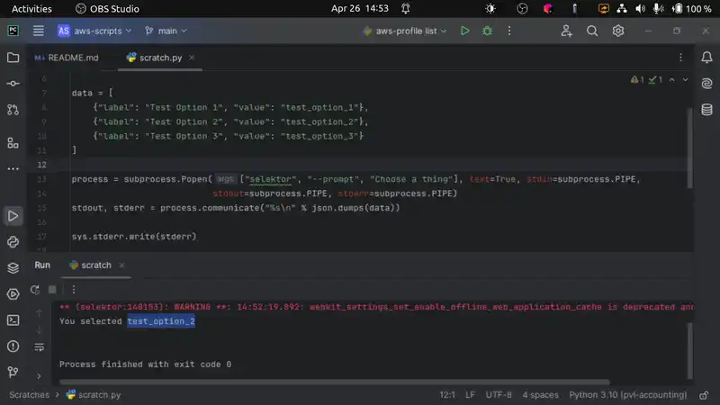

# selektor

Select from available options with scripting. This is a simple GUI application that pipes the selected option back to 
the script.



## Installation

### Prebuilt Binaries

* Visit the latest release to get the binary for your platform. 
* Copy it to a directory in your PATH environment variable. 
  * rename it to 'selektor' if you downloaded the MacOS or Linux version 
  
The MacOS build is universal and will work on Intel and ARM Macs. 

These binaries are not currently signed, but will be eventually.

### Build it yourself

* [Install all the dependencies for Tauri development](https://tauri.app/v1/guides/getting-started/prerequisites/)
* `npm install`
* `npm run tauri build` 

Copy the resulting binary nested somewhere in `src-tauri/target` to a directory in your PATH. 

## Usage

Pass a JSON object with this format into `selektor`: `[{label: "Label value", value: "Program value"}]`. You can pass this 
in either through an environment variable `SELEKTOR_OPTIONS`, through a CLI argument `--options json-text`, or through STDIN.   

If you use STDIN, append a newline to the JSON string. 

If you'd like to change the prompt in the text box you can do it through the environment variable `SELKTOR_PROMPT` or
through the CLI argument `--prompt "Your Prompt Here..."`. 


## Example

This can be run in Python 3. You can similarly use this in other languages and in shell scripts.

```python
#!/usr/env python3

import sys
import json
import subprocess

data = [
    {"label": "Test Option 1", "value": "test_option_1"},
    {"label": "Test Option 2", "value": "test_option_2"},
    {"label": "Test Option 3", "value": "test_option_3"}
]

process = subprocess.Popen(["selektor", "--prompt", "Choose a thing"], text=True, stdin=subprocess.PIPE,
                           stdout=subprocess.PIPE, stderr=subprocess.PIPE)
stdout, stderr = process.communicate("%s\n" % json.dumps(data))

sys.stderr.write(stderr)

if process.returncode != 0:
    sys.stderr.write("Process exited with code %d\n" % process.returncode)
else:
    sys.stdout.write("You selected %s\n" % stdout)

```


